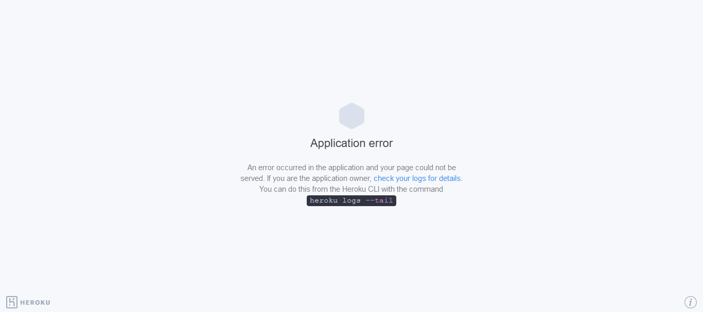

# House-Price Prediction

* The aim of this project was to be able to estimate house prices (usd) based on given input data.
* The original dataset was of 1460 observations and 81 variables (including target variable).
* The variables were of numeric as well as non-numeric nature.
* The dataset was analyzed through extensive _**Seaborn**_ and _**Matplotlib**_ visualizations (plots, heatmap).
* After thorough analysis of the dataset, 8 numeric features and 6 non-numeric features were selected for further analysis.
* The criteria for selection of features was based on the level of correlations, variability of the variables with respect to the target variable.
* Handled missing values and potential extreme values using _**Pandas**_.
* Implemented _**Pipelines**_ for a suite of regression models using _**Sci-Kit Learn**_.
* Results of the final model were reported on the training data as well as the testing data.

 

### Links:
* [*Dataset*](https://www.kaggle.com/c/house-prices-advanced-regression-techniques/data)
* [*Web-App*](https://home-prices-predictor.herokuapp.com)
* [*Web-App Repo*](https://github.com/MisbahullahSheriff/HousePrice-Deployment)

 

**---------- IMPORTANT NOTE ----------**
* If the web-app throws an **error** message as shown below, it's probably due to the monthly limitation provided by Heroku being exceeded.
* Please try opening the web-app again at the start of the new month.

 

### Algorithms Used:
* Initially various regression algorithms were observed.
* Based on performance, following algorithms were selected for further optimization:
  * _**Linear Regression**_
  * _**Ridge**_
  * _**Support Vector Regressor**_
  * _**Random Forest Regressor**_
  * _**Ada Boost Regressor**_
  * _**Gradient Boosting Regressor**_
  * _**Voting Regressor**_
* Atlast, the _**Voting Regressor**_ model was selected for deployment.
* Model evaluation method: **cross-validation**.
* Model evaluation criteria: **mean squared error**.

 

### Libraries Used:
* Pandas, Numpy, Sci-Kit Learn, Matplotlib, Seaborn

 

**Give this repo a :star: if you liked my work.**

### Thank You!:smiley:
